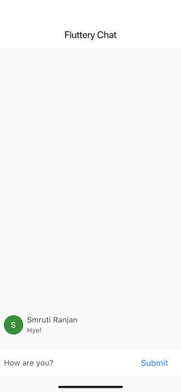

# Flutter Cookbook

###### This cookbook contains recipes that demonstrate how to solve common problems while writing Flutter apps. Each recipe is self-contained and can be used as a reference to help you build up an application.

## [Flutter Awesome Widgets](https://github.com/smrutiranjanrana/Flutter-Awesome-Widgets)

* Alert dialog
* Appbar
* Asset images
* Basic list
* Bottom navigation
* Cached image
* Collapsing layout
* Column
* Drawer
* Dropdown
* Fade In images
* Fading widget
* Gesture detector
* Grid view
* Horizontal list
* Image from network
* Long grid
* Long list
* Page view
* Radio buttons
* Radio tiles
* Raised button
* Ripple effect
* Rows
* Snackbar
* Stepper
* Swipe to dismiss
* Tabs
* Tabs 2
* Text field
* Typography
* UI orientation

## [More from Flutter](https://github.com/smrutiranjanrana/More-From-Flutter)

* Custom fonts
* Load JSON from network
* Load local JSON
* Navigation

## [Flutter Animations](https://github.com/smrutiranjanrana/Flutter-Animations)

* Animated container
* Fade transition
* Opacity
* Twin animation

## Flutter Sample Apps

* [Flutter URL Launcher](https://github.com/smrutiranjanrana/Flutter-URL-Launcher)
* [Flutter Auth App](https://github.com/smrutiranjanrana/Flutter-Auth-App)
* [Fluttery Chat](https://github.com/smrutiranjanrana/Fluttery-Chat)

